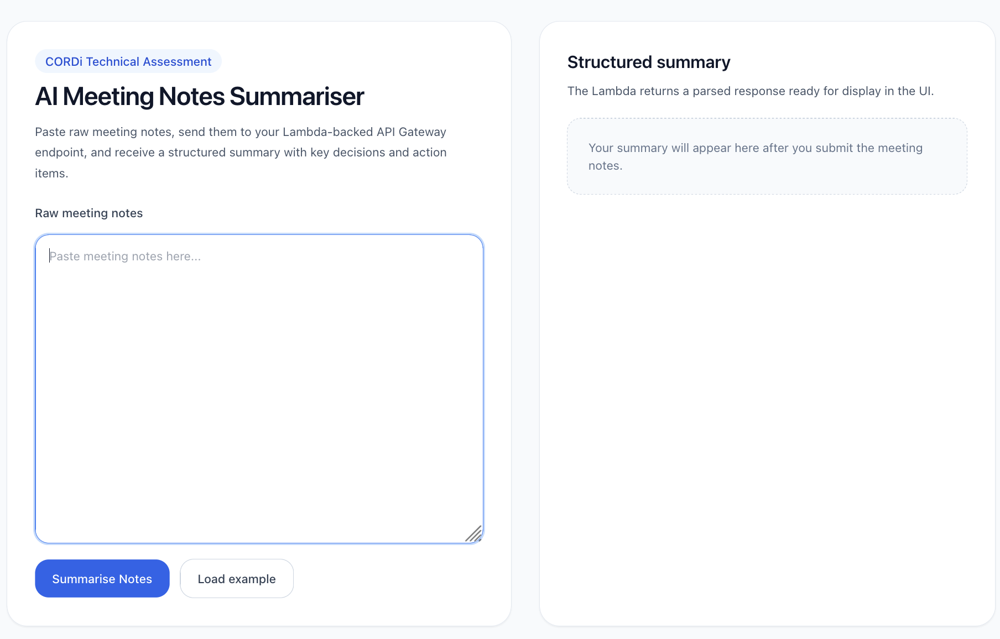
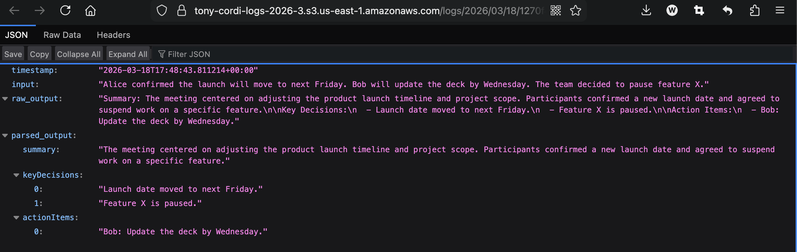
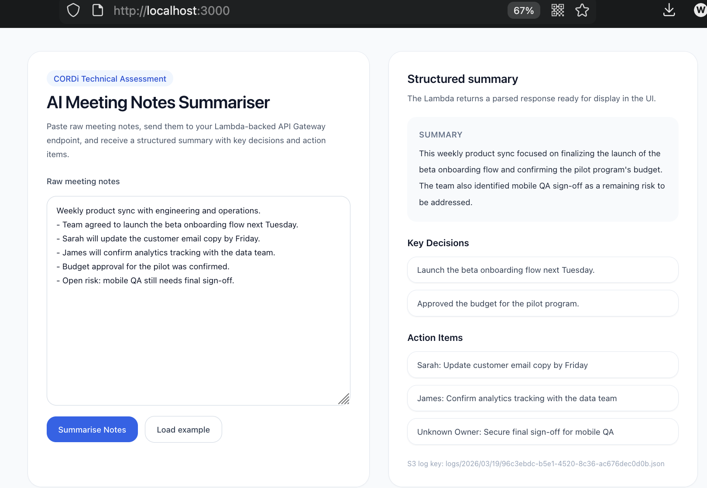
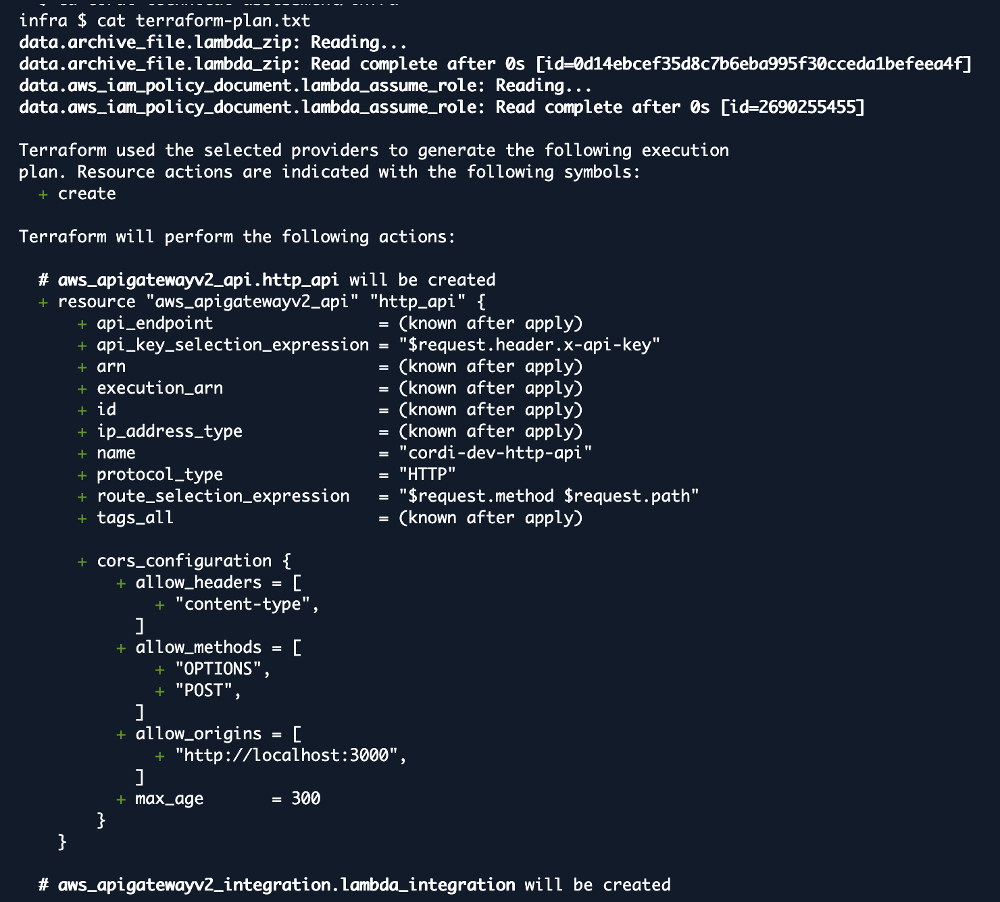

# CORDi Technical Assessment — AI Meeting Notes Summariser

This repository contains my submission for the CORDi full-stack technical assessment.

The application lets a user paste raw meeting notes into a Next.js web UI, send them to an AWS Lambda function through API Gateway, and receive a structured summary containing:
- a short summary
- key decisions
- action items

Each request is also logged to S3 with the raw input, model output, parsed output, and timestamp.

## Stack

- **Frontend:** Next.js 15, App Router, TypeScript, Tailwind CSS
- **Backend:** AWS Lambda (Python 3.12)
- **API:** API Gateway HTTP API with CORS enabled for localhost
- **Storage:** Amazon S3 for JSON request/response logs
- **Infrastructure:** Terraform split into logical files under `infra/`
- **Model integration:** Gemini via Google Generative Language API

## Architecture
1. The user enters raw meeting notes in the Next.js frontend.
2. The frontend sends a `POST /summarise` request to API Gateway.
3. API Gateway invokes the Lambda summariser.
4. The Lambda sends a prompt to Gemini and receives a structured response.
5. The Lambda parses the response into `summary`, `keyDecisions`, and `actionItems`.
6. The Lambda writes a JSON log to S3.
7. The parsed response is returned to the frontend for display.

## Project structure

```text
.
├── backend/
│   └── lambda/
│       └── index.py
├── docs/
│   ├── ai-usage.md
├── frontend/
│   ├── app/
│   │   ├── globals.css
│   │   ├── layout.tsx
│   │   └── page.tsx
│   ├── next.config.ts
│   ├── package.json
│   ├── postcss.config.js
│   ├── tailwind.config.ts
│   └── tsconfig.json
├── infra/
│   ├── api_gateway.tf
│   ├── dev.tfvars
│   ├── iam.tf
│   ├── lambda.tf
│   ├── outputs.tf
│   ├── providers.tf
│   ├── s3.tf
│   ├── terraform-plan.txt
│   └── variables.tf
└── README.md
```

## Prerequisites

Install these locally before running the project:
- Node.js 15+
- npm 10+
- Terraform 1.6+
- AWS CLI configured with credentials that can create Lambda, API Gateway, IAM, and S3 resources

You also need a valid **Gemini API key**.

## Important configuration note

The original starter Terraform variable names are still called:
- `api_key`
- `model`

In this implementation, those Terraform variables are reused to avoid a wider Terraform refactor, but they are passed into Lambda as Gemini settings.

That means:
- put your **Gemini API key** into `api_key`
- put your **Gemini model name** into `model`

## Configure `infra/dev.tfvars`

Update `infra/dev.tfvars` before deployment.

Example:

```tfvars
project_name = "cordi-tony-demo"
aws_region   = "us-east-1"

bucket_name = "your-globally-unique-bucket-name"

anthropic_api_key = "YOUR_GEMINI_API_KEY"
anthropic_model   = "gemini-3-flash-preview"

cors_allow_origins = [
  "http://localhost:3000"
]

lambda_timeout     = 30
lambda_memory_size = 256
```

Notes:
- `bucket_name` must be globally unique across AWS
  
## Deploy infrastructure with Terraform

From the repository root:

```bash
cd infra
terraform init
terraform plan -var-file=dev.tfvars | tee terraform-plan.txt
terraform apply -var-file=dev.tfvars
```

After deployment, get the API base URL:

```bash
terraform output -raw api_base_url
```

## Run the frontend locally

From the repository root:

```bash
cd frontend
```
```md
Manually create a file named `.env.local` in the `frontend` folder, then add:
```
```env
NEXT_PUBLIC_API_BASE_URL=https://YOUR_API_ID.execute-api.YOUR_REGION.amazonaws.com
```
Do **not** add `/summarise` to this value.

Then start the app:

```bash
npm install
npm run dev
```

Open:

```text
http://localhost:3000
```

## Test the API directly

From the `infra` directory:

```bash
curl -i -X POST "$(terraform output -raw api_base_url)/summarise" \
  -H "Content-Type: application/json" \
  -d '{"meetingNotes":"Alice confirmed the launch will move to next Friday. Bob will update the deck by Wednesday. The team decided to pause feature X."}'
```

If the deployment is healthy, you should receive a `200` response with fields similar to:

```json
{
  "summary": "...",
  "keyDecisions": ["..."],
  "actionItems": ["..."],
  "rawModelResponse": "...",
  "logKey": "logs/2026/03/19/example.json"
}
```

## Frontend behaviour

The frontend includes:
- a single textarea for raw meeting notes
- a submit button
- a loading state while waiting for the API
- graceful error display
- sections for Summary, Key Decisions, and Action Items

## S3 logging

For every successful request, Lambda writes a JSON object to S3 containing:
- `timestamp`
- `input`
- `raw_output`
- `parsed_output`


<p>
The UI also displays the returned S3 log key so the result can be verified.

## Terraform files

The infrastructure is intentionally split into logical files:
- `providers.tf`
- `variables.tf`
- `s3.tf`
- `iam.tf` 
- `lambda.tf`
- `api_gateway.tf`
- `outputs.tf`

## Submission checklist
- a working end-to-end screenshot
  
- `infra/terraform-plan.txt` generated from your real environment
  

## Model used

This implementation uses **Gemini** through the Google Generative Language API.

In the current codebase, Terraform variables still use the names `api_key` and `model` for compatibility with the original starter, but the deployed Lambda uses those values as the Gemini API key and Gemini model configuration.

## AI Usage 
(please see [docs/ai-usage.md](docs/ai-usage.md) for full conversation history)
<br>
AI tools were used in the build process to support planning, debugging, and documentation. Specifically, AI was used to:

clarify the project requirements and break the task into frontend, backend, and infrastructure steps

troubleshoot local setup, AWS CloudShell usage, Terraform errors, and API integration issues

refine the Lambda implementation and improve the README structure

generate and revise sample test inputs for the application

All implementation decisions were reviewed manually before being applied. Generated suggestions were tested and adjusted during development.
